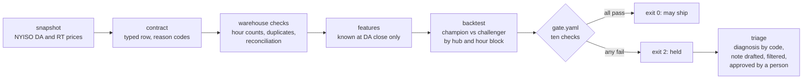

# Thyra

Thyra is a small QA project that shows how I tested a risk-based trading platform for the energy markets.

The platform forecast day-ahead (DA) and real-time (RT) energy prices for a client of my previous employer. Thyra is the public copy of its quality pattern: public NYISO prices in a fixed snapshot, a data contract at the door, counts and reconciliation in the warehouse, a champion-versus-challenger backtest and a release gate that returns an exit code. It contains no client code, data or names.

[](https://github.com/blakecodex/thyra_data_quality/actions/workflows/ci.yml)

## Two commands

```
pip install -r requirements.txt
python -m thyra.demo
```

The demo runs the gate twice on the same snapshot, about ten seconds in all. The first run is the release as published; every check passes and the exit code is 0. The second run carries three seeded defects: the 25-hour day labelled one hour early, a file loaded twice with one row changed and a feature the training code computed and the serving path never did. Four checks pass, six fail, the exit code is 2 and the table names each failed control.

```
  check                         value   threshold          result
  quarantine_rate              0.0000   <= 0.005           pass
  hour_count_days_wrong             1   == 0               FAIL
  duplicate_conflicts               1   == 0               FAIL
  reconcile_share_off          0.0090   <= 0.02            pass
  reconcile_mean_abs           0.1022   <= 0.5             pass
  overall_improvement          2.1241   < 0.0              FAIL
  peak_no_regression           2.0799   <= 0.0             FAIL
  hub_no_regression            3.1414   <= 0.0             FAIL
  band_coverage                0.8172   within [0.85, 0.95] FAIL
  psi_max                      0.1236   <= 0.25            pass
  4/10 passed -> exit 2 (release held)
```

`python -m pytest -q` runs 63 tests in under a minute. `python -m thyra.triage out/demo/seeded` drafts the incident note from the seeded run's report and asks a person to approve it.

## The path a release takes



## What is inside

| piece | what it does |
|---|---|
| `data/snapshot/` | NYISO zonal prices for October 1, 2025 to January 31, 2026, pulled once by `pull_snapshot.py`; the day-ahead hourly price, the real-time price about every five minutes, the publisher's integrated hourly real-time price and the zonal load forecast; `manifest.json` records the sources and the hashes |
| `thyra/clock.py` | local days have 23, 24 or 25 hours; positions in the day go to UTC and back, and a test proves the round trip on every hour of every day |
| `thyra/feeds.py` | reads the snapshot by position in the day, integrates the five-minute price to the hour the way the publisher does and holds the seeded defects |
| `thyra/contract.py` | the row contract (pydantic, extra fields forbidden); a refused row is quarantined with a reason such as `hour_before_day` or `unit_not_usd_mwh` |
| `thyra/reconcile.py` | retries against conflicts, hour counts on the full hub-day grid and the verified price applied exactly once |
| `thyra/features.py` | features from what was known at day-ahead close; the lag source is the preliminary series by default, and a test pins it |
| `thyra/model.py`, `thyra/evaluate.py` | ridge champion and challenger with empirical bands; paired bootstrap on the difference in MAE, segments by hub and hour block, coverage, pinball loss and a guarded PSI |
| `gate.yaml`, `thyra/gate.py` | ten checks with a reason beside each threshold; exit 0 ships, 2 holds, 1 means the gate could not run and that holds too |
| `thyra/triage.py` | code names the most upstream failure; a template or a model on Bedrock drafts six lines; a filter rejects any number absent from the report, any moved threshold and any release decision; a person approves, edits or rejects |
| `diagrams/` | every figure in the presentation, one Python file each |

## Three things the real data taught the checks

The fall-back day, November 2, 2025, has 25 hours, and the publisher lists 01:00 twice; hours are counted by position and the repeated hour by the order of its two passes. The five-minute dispatch does not always run every five minutes; integration to the hour is weighted by interval length, and the result agrees with the publisher's hourly file to nine cents on average. The last week of January 2026 was a winter storm, with real-time prices past 2,000 $/MWh; the gate scores the candidate on January 1 to 23, and the storm is kept as the production window the monitoring chart reads.

## Limits

One grid operator; eleven load zones standing in for hubs; one model family, chosen for readability; a snapshot of four months. The seeded defects are the ones I met on the platform, rebuilt on public data. The gate runs in seconds here and took about a day there.
